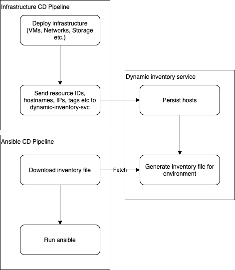

# dynamic-inventory-svc

Concept for learning Go. Not very well defined in what the project should achieve, mostly based from a flow chart I made for integrating using a custom dynamic inventory provider with Ansible in a CI environment with more flexibility around tagging roles and environments onto servers.



## Integration

This was designed with a 2 stage CI process for infrastructure in mind but should be flexible enough to work for any CI process.

- Stage 1 - Infrastructure (Terraform, Pulumi, etc.)
- Stage 2 - Configuration (Ansible). Triggered on stage 1 success.

Steps to integrate:

- Send information about host(s) to service once CI stage 1 has completed.
- Stage 2 starts, download inventory file from service.
- Run configuration tool with generated inventory file.

### Example requests

```json
// POST api/v1/hosts/:env
{
    "name": "mongo1",
    "ip": "10.0.0.10",
    "roles": [
      "server",
      "mongodb"
    ]
}
```

```json
// GET api/v1/inventory/:env
{
  "all": {
    "hosts": {},
    "children": {
      "server": {
        "hosts": {
          "mongo1": null
        }
      },
      "mongodb": {
        "hosts": {
          "mongo1": null
        }
      }
    }
  }
}
```

## Requirements

- Go `1.14`

## Build and run

```sh
go build github.com/harrymitchinson/dynamic-inventory-svc/cmd/server && ./server
```

## Future ideas

- CLI tool for CI processes to interact with service rather than using CURL
